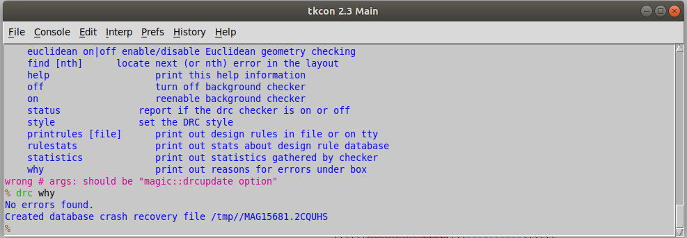

# Advanced Physical Design Workshop using OpenLane/Sky130


## Index 

1. [Overview](#overview)
2. [Pre-Requisites](#pre_req) 
3. [Installation](#inst)
4. [Day-1 : Inception of open-source EDA. OpenLANE and Sky130 PDK](#day1)
    - Fundamentals Learned :
        - [Exploring the Software-Hardware coupling](#hw-sw) 
        - [SoC using Open-Source Tools](#soc_os)
        - [Introduction to RTL-to-GDS2 flow](#rtl_gds2) 
        - [OpenLANE flow](#ol_flow)

    - Lab work :
        - [SkyWater PDKs](#sky_pdk)
        - [Initialising OpenLANE](#ini_ol)
        - [Importing Package](#im_pkg)
        - [Design Folder Hierarchy](#des_hier)
        - [Preparing Design](#prep_des)
        - [Running Synthesis](#run_syn)
        - [List of vital openLANE tool commands](#ol_cmd) 
          

5. [Day-2 : Floor-Planning and Introduction to Library Cells](#day2) 
    - Lab work :
        - [Viewing Floorplan and Placement Variables](#fp_pl)
        - [Running Floorplan](#run_fp)
        - [Invoking Magic to view generated Floorplan](#magic_fp)
        - [Running Placement and viewing it on magic](#magic_pl)
    

6. [Day-3 : Designing Library Cells using magic and ngspice tools](#day3) :
    - Lab work :
        - [Importing CMOS-Inveter Files](#import_inv)
        - [Inspecting CMOS-Inverter layout on magic](#magic_inv)
        - [Design Inference](#des_inf)
        - [Extracting SPICE from layout](#ext_spice)
        - [Updating SPICE Deck](#upd_spice)
        - [Running Updated SPICE on ngspice](#ngspice_inv)

7. Day-4 : Pre-Layout Timing Analysis

8. Day-5 : Final stages of RTL-to-GDS2 flow and closure 

9. Overall Experience 

10. Acknowledgements 
<br/>

<a id="overview"></a>
## Overview

The workshop's goal is to provide fundamental knowledge about the ideas behind the Physical Design flow, an important part of the fundamental VLSI flow. Physical Design is broad topic and would require years to come close to mastering. Yet workshop attempts to convey the principles in a concise manner that is just enough to begin working on actual designs. The program is incredibly insightful and intriguing due to the way that concepts are coupled with the practical experience obtained through lab modules. 

This repository serves as an archive of all the knowledge I acquired and encountered during the session. I have utilised several snippets to demonstrate the ideas I gathered in the lectures and the outcomes of my lab module. The "images" branch compiles all of the illustrations used throughout in chronological order. 

I sincerely hope that anybody reading this discovers something new about physical design and is inspired to explore more about the domain.
<br/>  

<a id="pre_req"> </a>
## Pre-Requisites

### Technical :
- Ubuntu OS-based System
- 25GB+ Disk Space

### Non-Technical :
- Zeal to learn 
<br/>

<a id="inst"></a>
## Installation 

Visit the link : https://github.com/nickson-jose/openlane_build_script for installation steps
<br/>
<br/>

<a id="day1"></a>
## Day-1 : Inception of open-source EDA. OpenLANE and Sky130 PDK

The workshop's primary goal on the first day was to familiarise us with the foundational ideologies outlined below in order to lay the groundwork for the days to come.

<a id="hw-sw"></a>
### Exploring the Software-Hardware coupling :

The most commonly used application software or apps such as Microsoft Word, Excel, Powerpoint etc. run on a system i.e the hardware which is essentially a combination of multiple components making up the chip. Hene there exists an elaborate pathway that ensues the communication between the hardaware and the software applications. The illustration below showcases the hardware-software coupling : 


As it is evident in the illustration above, there lies an elaborate pathway for the communication between hardware and software. To briefly explain this pathway:

- The application requires an operating system to run on such as linux, MacOs, Windows etc. OS performs numerous tasks involving managment of memories and background processes. In this context, the OS job is to convert the software application into it's respective assembly language and further onto binary(machine language).

- Evidentally, the output of an OS is a simple C/C++/Java or other high-level language.

- The compiler then, uses the source files generated through the high-level language to create object files. These object files contain the **Instruction Sets** whose syntax is specific to the architecture of the chip of the system. eg : 8086 instruction sets, RISC-V instruction sets etc.

- These instruction sets are interpreted by the Assembler and is used to finally generate machine language program that contains 0s and 1s in the form of operation-code or **op-code** in short. These op=code are understood by the chip and directs the hardware to perform the task in order to generate desired results.

<br/>

The flow can be visualized in a better way via an example :
> Let us take an instance of operating a basic Stop-Watch app.
>> Re-tracing the flow from the beginning the output of the OS could look something like under :
>> 
>> 
>>
>> ###### *A simple C-program capturing the behaviour of stop-watch app.*
>> 
>> The compiler processes this code to generate the instruction set specific to the chip being used. In this workshop we would be focusing on "picorv32a" core, hence the instruction set would follow the RISC-V Architecture. The illustration below showcases the sample generated compiler :
>>
>> 
>>
>> 
>> The instruction set from compiler are then taken by the assembler to generate a machine language program that is interpreted by the chip.
>>
>> 
>>
>> 
>> As observed in the snippet above, the assembler converts the sample instruction *"add x6,x10,x6"* (that essentially means adding the contents of registers *x6* and *x10* and putting the result into *x6* register) into an op-code that can be implemented by the hardware.


> [!IMPORTANT] 
> From this basic example discussed above, it is clear that the *Instruction-Set* acts as an interface between the communication of hardware and software and hence it is also termed as **Abstract Interface**.
<br/>

<a id="soc_os"></a>
### SoC using OpenSource Tools : 

A basic System-On-Chip (commany reffered as SoC) serves as the heart to most of the intricate electronic systems. The components required to create an ASIC can be visualised via the image below : 


These three fundamental components : **RTL IP's**, **EDA Tools** and **PDK Data** are vital for SoC develpoment. These industry-standard components aren't readily available to the masses and hence it has been a challenge to get hands-on experience on the VLSI flow. Fortunately, the open-source version of these components are available on the internet that can be used to bridge the gap between academic learning and industry-level work. 

Before exploring the open-source realm of VLSI, we need to develop a basic insight on the three components mentioned above. 
- RTL IP (Register-Transfer Level Intellectual Property) : It refers to pre-designed and verified digital circuit components or modules that are described at the register transfer level (RTL) abstraction in the form of IPs. These components are ready to be integrated into larger digital designs.
  
- EDA Tools (Electronic Design Automation Tools) : These CAD tools are basically used to automate the processes involved in the VLSI flow. Automation allows easier fault detection and debugging, improved collaboration and faster fabrication.
  
-  PDK (Process Design Kit) : These are extremely crucial elements in any digital design. These basically act as an interface between FAB and designers. Collection of files used to model fabrication process for EDA tools used to design IC. Includes (not limited to ) :
      - Process Design Rules : LVS, DRC
      - Standard Cell Libraries
      - Delay Information
      - I/O Libraries
      - and so on ...

The process of experiencing the ASIC designing is easier than ever due to the components becoming Open-Source. The illustration below shocases the various open-source platforms available. We will primarily discuss on a specific flow : **OpenLANE** which uses an array of Open-Source tools to automate the design flow, later on in this segment.


<br/>

<a id="rtl_gds2"></a>
### Introduction to RTL-to-GDS2 flow : 

In an ASIC Design, the typical RTL-to-GDS2 flow is demonstrated in the illustration below : 


In the workshop, a simplified version of this flow was introduced which is just enough to grasp the idea of the overall flow. This simplified flow is demonstrated below : 


These steps can be briefly explained follows :

- Sythesis : This is the first step in the basic flow. RTL created using any HDL (Verilog, VHDL) alongwith the design and environment constraints(reffered as SDC: Synopsys Design Constraint) are used in synthesis process to generate a synthesised *gate-level netlist*. This netlist demonstrates the logical conectivity of the RTL design.
  >The following illustration shows a basic Sythesis from an RTL :
  >> 

- Floor Planning and Power Planning : FP/PP could differ in meaning depending on the scope of implementation on the design. Typically, the scope include:
    - Macro-level and,
    - Chip-level

  The objective of FP/PP is to plan the silicon area and create robust power network to efficiently power the design.
  > The Macro and Chip level floorplanning are briefly described as under :
  >> 
  >>
  >> 

  In power planning, the power network is constructed. Typically, a chip is powered by multiple Vdd and Vss pins. The power pins are connected to all components through power rings and horizontal/vertical straps.
  > [!NOTE]
  > The parallel cross-sectional structure (as shown in figure below) is meant to reduce the resistance and ultimately minimise the IR drop and mitigate the electro-migration problem.
  
  
<br/>
   
- Placement : After the FP/PP stage comes the Placement stage. In this stage, the macro cells from the gate-level netlist are placed on the designed floorplan. The connected cells are placed close to each other to minimise *inter-connect* delay and to ensure effective post-placement optimization for easier routing.

  > Placemet can be visualised using the illustration below :
  >> 
  >> ###### *In this example the macro-cells of simple gate-level netlist containing inverter,nand gate, or gate and d-flip flop are placed close to each other in the floor plan.*

  Placement is typically done in two steps, namely **Global** and **Detailed** routing.
  
  > These two placement methods can be briefly explained as under :
  >> 
  >> ###### *The first image shows the global placement and the second shows detailed placement.*
  >> The global placement tries to evaluate the most optimal positions for all cells. But these positions may not be **legal**, that means the cells might overlap or may go off the floorplan allocated.
  >> 
  >> The detailed placement corrects the cell-overlap issue in global placement by minimally altering the positions to make them legal.
<br/>

- Clock-Tree Synthesis (CTS) : Before proceeding to routing, we need to perform the CTS on the post-placement layout. The clock needs to reach multiple cells in the layout hence, to maintain the signal integrity it needs to go through stages of buffers and repeaters. This calls for an organized network to distribute the clock across the layout. This network is known as the Clock Tree.

  > The illustration below summarizes the CTS stage
  >> 
<br/>

- Routing : After CTS stage, we are required to do the Routing. It involves connecting the placed macro cells for signal propagation via nets. Given placements and fixed number of metal layers, the router tools is expected to find a valid pattern of horizontal and vertical wires to implement the nets. The metal layer information is extracted by the PDK that contains the parameters such as pitch, number of tracks, thickness, minimum width, vias etc.

  > Routing in *sky130 PDK* is shown as under :
  >> 
  >> ###### *The second figure illustrates the metal layer structure as defined in Sky130 PDK.*

  > [!IMPORTANT]
  > The sky130 PDK defines **six metal layers**, the bottomost layer made of *Titanium Nitride* is known as *Local Interconnect Layer*. The rest of the five layers are all composed of aluminium.

  Most routers construct the metal-layer grid using metal tracks. Since, the metal-grids are usually large **Divide and Conquer** approach is used that can be explained as under. 
  - Global Routing : In the global route phase of the physical design, simplified routes are used to estimate routing lengths, and the routing estimates are used to determine resistance and capacitance that are needed to compute wire delays.
  - Final Routing : Uses the global routing guides to implement the actual wiring.
<br/>

- Signoff : After routing, comes the final sign-off stage. In this stage the final layout can be constructed which undergoes numerous verification that are as under :
  - Physical Verification
      - Design Rule Checks (DRC) : making sure that final layout follows the design rules
      - Layout vs Schematic (LVS) : making sure that the final layout matches the initial gate-level netlist 
  - Timing Verification
      - Static Timing Analysis (STA) : To ensure that the final layout meets the timing constraints and all the paths are properly timed.
<br/>

<a id="ol_flow"></a>
### OpenLANE flow : 

There are various steps to the OpenLANE flow. By default, each step of the flow is carried out in sequence. There may be several sub-stages within each stage. As demonstrated below, OpenLANE can also be used interactively.


Synthesis :
   - `Yosys` : Performs RTL synthesis
   - `abc` : Conducts technology mapping to the reference cells in the PDK. To get desired results, synthesis procedures can be modified utilising various integrated abc scripts.
   - `OpenSTA` : Performs static timing analysis on the resulting netlist to generate timing reports
   - `Fault` : Scan-chain insertion used for testing post fabrication. Supports ATPG and test patterns compaction

Floorplan and PDN (Power Distribution Network) :
   - `Init_fp` : Defines the core area for the macro as well as the rows (used for placement) and the tracks (used for routing)
   - `Ioplacer` : Places the macro input and output ports
   - `PDN` : Generates the power distribution network
   - `Tapcell` : Inserts welltap and decap cells in the floorplan
   - `Placement` : It is done in two steps: first, with global placement, where designs are placed across the chip but are not legal because some standard cells overlap; second, with detailed placement, where designs are made legal and are guaranteed to fit in standard cell rows.
   - `RePLace` : Performs global placement
   - `Resizer` : Performs optional optimizations on the design
   - `OpenPhySyn` : Performs timing optimizations on the design
   - `OpenDP` : Perfroms detailed placement to legalize the globally placed components

CTS :     
   - `TritonCTS` : Synthesizes the clock distribution network
  
Routing : 
   - `FastRoute` : Performs global routing to generate a guide file for the detailed router
   - `TritonRoute` : Performs detailed routing from global routing guides
   - `SPEF-Extractor` : Performs SPEF extraction that include parasitic information
      
GDSII Generation :
   - `Magic` : Streams out the final GDSII layout file from the routed def
  

Checks :
   - `Magic` : Performs DRC Checks & Antenna Checks
   - `Netgen` : Performs LVS Checks
      

## Lab-Work : 

<a id="sky_pdk"></a>
### SkyWater PDKs

We are dealing with the Skywater PDK files listed under $PDK_ROOT. For the workshop, three subdirectories are required.


Evidently, there are three pdks available that can be briefly explained as follows 
- skywater pdk : Contains all the foundry provided PDK related files
- open_pdks : Contains scripts that are used to bridge the gap between closed-source and open-source PDK to EDA tool compatibility
- sky130A : The open-source compatible PDK files
<br/>

<a id="ini_ol"></a>
### Initialising OpenLANE

```
./flow.tcl -interactive 
```
- The flow.tcl is the script which runs the OpenLANE flow.
- OpenLANE can be run interactively or in autonomous mode, the `-interactive` switch allows openlane to run in interactive mode.


<br/>

<a id="im_pkg"></a>
### Importing Package

To operate OpenLANE, certain software dependencies are required. To add these to the OpenLANE tool, we must execute:

```
% package require openlane 0.9
```


<br/>

<a id="des_hier"></a>
### Design Folder Hierarchy

All designs run within OpenLANE are extracted from the `openlane/designs` folder. The design hierarchy in openlane is as follows : 


Each design hierarchy comes with two distinct components:

- Src folder : Contains verilog files and sdc constraint files
- Config.tcl files : Design specific configuration switches used by OpenLANE

An example of config.tcl is given as under :


<br/>

<a id="prep_des"></a>
### Preparing Design

The command `prep` is used to generate file structure for our design. The entire command is executed as under :

```
% prep -design <design_name> 
```
The argument `-design` specifies the name of design folder. In our case, `<design_name>` is `picorv32a`.


Due to running the prep command, in the `picorv32a/runs` path the results and report files is created.


> [!IMPORTANT]
> All of the OpenLANE parameters used for this particular run are contained in the `config.tcl` file displayed in this folder.

Additionally, the information from the technology LEF and cell LEF is combined when the design is prepared in OpenLANE. Layer definitions and a set of constrained design guidelines required for PnR flow are contained in the LEF information. To reduce DRC errors during PnR flow, the cell LEF of each standard cell carries obstruction information:


<br/>

<a id="run_syn"></a>
### Running Synthesis

Synthesis can be run using the command as under :
```
% run_synthesis
```

> Minor Task provided in the lab : 
>> To find out the ratio of *flop-ratio* i.e number of d-flip-flops to number of cells. For the run we have :
>> 
>> ###### *In the snippet above, the total number of cells are 14,876*
>> 
>> ###### *In the snippet above, the number of d-flops are 1,613*
>>
>> Hence, the `flop-ratio` comes out to be **0.1084**.
<br/>

<a id="ol_cmd"></a>
### List of vital openLANE tool commands

In openlane it is extremely vital to follow the correct sequence of commands while operating it in `interactive` mode for proper functioning of the flow. The list below shows the command flow in openlane :

1. `prep -design <design> -tag <tag> -config <config> -init_design_config -overwrite` similar to the command line arguments, design is required and the rest is optional
2. `run_synthesis`
3. `run_floorplan`
4. `run_placement`
5. `run_cts`
6. `run_routing`
7. `write_powered_verilog` followed by `set_netlist $::env(routing_logs)/$::env(DESIGN_NAME).powered.v`
8. `run_magic`
9. `run_magic_spice_export`
10. `run_magic_drc`
11. `run_lvs`
12. `run_antenna_check`


The above commands can also be written in a file and passed to `flow.tcl`:

```
./flow.tcl -interactive -file <file>
```
<br/>

<a id="day2"></a>
## Day-2 : Floor-Planning and Introduction to Library Cells :

- In Floorplanning we typically set the:

1. Die Area
2. Core Area
3. Core Utilization
4. Aspect Ratio
5. Place Macros
6. Power distribution network (Normally done here but done later in OpenLANE)
7. Place input and output pins

<a id="fp_pl"></a>
### Viewing Floorplan and Placement Variables :


The Floorplan and Placement variables can be seen below :


The Floorplan defaults are as under :


<br/>

<a id="run_fp"></a>
### Running Floorplan :

Floorplan can be run using the command :
```
% run_floorplan
```


We can view the results of floorplan in the directory :


The generated `floorplan.def` is as under :


<br/>

<a id="magic_fp"></a>
### Invoking Magic to view generated Floorplan :

In order to view the floorplan on magic, we need to locate the following components as an input to the `magic` tool :

1. Magic technology file (sky130A.tech)
2. Def file of floorplan
3. Merged LEF file

Use the command :
```
> magic -T <path_tech_lef_for_magic> lef read <path_to_merged_lef> def read <floorplan.def>
```
> [!NOTE]
> For reference : In the code above, `<path_tech_lef_for_magic>` is used as `/home/vsduser/Desktop/work/tools/openlane_working_dir/pdks/sky130A/libs.tech/magic
` ; `<path_to_merged_lef>` is used as `../../tmp/merged.lef` ; `<floorplan.def>` is used as `picorv32a.floorplan.def`.


The magic tool shows the following floorplan : 


<br/>

<a id="magic_pl"></a>
### Running Placement and viewing it on magic :

Placement can be run using the command : 
```
% run_placement
```

The results are populated on the `results/placement` directory and the `magic` tool can be used to investigate the result of placement stage, in a fashon similar to floorplan stage. The command used is :
```
> magic -T /home/vsduser/Desktop/work/tools/openlane_working_dir/pdks/sky130A/libs.tech/magic/sky130A.tech lef read ../../tmp/merged.lef def read picorv32a.placement.def  
```

The result of placement stage as constructed by the `magic` tool can be seen below :


The post placement analytics are as under :


<br/>

<a id="day3"></a>
## Day-3 : Designing Library Cells using magic and ngspice tools 

<!--Thory here-->


<a id="import_inv"></a>
### Importing CMOS-Inveter Files :

The cmos inverter files are provided in the *git-hub* repositry : https://github.com/nickson-jose/vsdstdcelldesign.

Use the command below, to clone the files present in the repositry into your working machine :
```
> git clone https://github.com/nickson-jose/vsdstdcelldesign
```
> [!NOTE]
> It is important that your virtual machine has git installed in it to run the command above. In case it isn't installed please run the following command before running the previous command :
> ``` sudo apt-get install git ```

It is recommended to clone the repositry in the main `openlane` directory. 


<br/>

<a id="magic_inv"></a>
### Inspecting CMOS-Inverter layout on magic :

Using the command as under, the magic tool can be invoked and the inverter layout can be examined. 
```
> magic -T /home/vsduser/Desktop/work/tools/openlane_working_dir/pdks/sky130A/libs.tech/magic/sky130A.tech sky130_inv.mag
```


The magic layout comes out as under :


<br/>

<a id="des_inf"></a>
### Design Inference :

Select the specific layer/device by hovering over the object and pressing, `s`, iteratively, until you traverse the hierarchy to the specified object:


 
Next, on the *tkcon* terminal type `what` to reveal the selected object on the layout.


Additionally, **DRC-errors** can also be viewed using the tkcon terminal. 


<br/>

<a id="ext_spice"></a>
### Extracting SPICE from layout :

To extract the parasitic spice file for the associated layout one needs to create an extraction file using the command `extract all`:


After generating the extracted file we need to output the .ext file to a spice file:


The created SPICE file can be seen in the `vsdcelldesign` directory 


<br/>

<a id="upd_spice"></a>
### Updating SPICE Deck :

The spice file generated needs some changes for proper sourcing in the ngspice tool, The updates are mentioned in the snippet as follows :


<br/>

<a id="ngspice_inv"></a>
### Running Updated SPICE on ngspice :

After updating the spice deck, we are set to source the updated spice file into the ngspice tool. Use the following command to invoke ngpsice :
```
> ngspice sky130_inv.spice
```
> [!NOTE]
> In case ngspice is not installed in your machine, please run the command shown to install ngspice :
> ```sudo apt install ngspice```


Use the command `plot y vs time a` to plot a graph.


<br/>

<a id="day4"></a>
## Day-4 : Pre-Layout Timing Analysis


