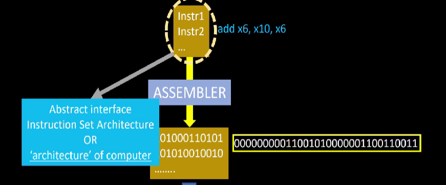

# Theory :

This file is an archieve to all the insights and knowledge I garnered through the workshop. It contains all the 5-Days of workshop separately. I am in the process of completing this file as I carve my handwritten notes onto this file. The heirarchical index in this file is as under :

## Index : 
- [Day-1 : Inception of open-source EDA, OpenLANE and Sky130 PDK](#day1)
  
    - [Exploring the Software-Hardware coupling](#hw-sw)
    - [SoC using Open-Source Tools](#soc_os)
    - [Introduction to RTL-to-GDS2 flow](#rtl_gds2)
    - [OpenLANE flow](#ol_flow)
    
- [Day-2 : Floor-Planning and Introduction to Library Cells](#day2)
- 
- 
- 

## Day-1 : Inception of open-source EDA, OpenLANE and Sky130 PDK

The workshop's primary goal on the first day was to familiarise us with the foundational ideologies outlined below in order to lay the groundwork for the days to come.

### Exploring the Software-Hardware coupling :

The most commonly used application software or apps such as Microsoft Word, Excel, Powerpoint etc. run on a system i.e the hardware which is essentially a combination of multiple components making up the chip. Hene there exists an elaborate pathway that ensues the communication between the hardaware and the software applications. The illustration below showcases the hardware-software coupling : 

As it is evident in the illustration above, there lies an elaborate pathway for the communication between hardware and software. To briefly explain this pathway:

- The application requires an operating system to run on such as linux, MacOs, Windows etc. OS performs numerous tasks involving managment of memories and background processes. In this context, the OS job is to convert the software application into it's respective assembly language and further onto binary(machine language).

- Evidentally, the output of an OS is a simple C/C++/Java or other high-level language.

- The compiler then, uses the source files generated through the high-level language to create object files. These object files contain the **Instruction Sets** whose syntax is specific to the architecture of the chip of the system. eg : 8086 instruction sets, RISC-V instruction sets etc.

- These instruction sets are interpreted by the Assembler and is used to finally generate machine language program that contains 0s and 1s in the form of operation-code or **op-code** in short. These op=code are understood by the chip and directs the hardware to perform the task in order to generate desired results.

 

The flow can be visualized in a better way via an example :
> Let us take an instance of operating a basic Stop-Watch app.
>> Re-tracing the flow from the beginning the output of the OS could look something like under :
>> 
>> 
>>
>> ###### *A simple C-program capturing the behaviour of stop-watch app.*
>> 
>> The compiler processes this code to generate the instruction set specific to the chip being used. In this workshop we would be focusing on "picorv32a" core, hence the instruction set would follow the RISC-V Architecture. The illustration below showcases the sample generated compiler :
>>
>> 
>>
>> 
>> The instruction set from compiler are then taken by the assembler to generate a machine language program that is interpreted by the chip.
>>
>> 
>>
>> 
>> As observed in the snippet above, the assembler converts the sample instruction *"add x6,x10,x6"* (that essentially means adding the contents of registers *x6* and *x10* and putting the result into *x6* register) into an op-code that can be implemented by the hardware.

> [!IMPORTANT] 
> From this basic example discussed above, it is clear that the *Instruction-Set* acts as an interface between the communication of hardware and software and hence it is also termed as **Abstract Interface**.
 

### SoC using OpenSource Tools : 

A basic System-On-Chip (commany reffered as SoC) serves as the heart to most of the intricate electronic systems. The components required to create an ASIC can be visualised via the image below : 

These three fundamental components : **RTL IP's**, **EDA Tools** and **PDK Data** are vital for SoC develpoment. These industry-standard components aren't readily available to the masses and hence it has been a challenge to get hands-on experience on the VLSI flow. Fortunately, the open-source version of these components are available on the internet that can be used to bridge the gap between academic learning and industry-level work. 

Before exploring the open-source realm of VLSI, we need to develop a basic insight on the three components mentioned above. 
- RTL IP (Register-Transfer Level Intellectual Property) : It refers to pre-designed and verified digital circuit components or modules that are described at the register transfer level (RTL) abstraction in the form of IPs. These components are ready to be integrated into larger digital designs.
  
- EDA Tools (Electronic Design Automation Tools) : These CAD tools are basically used to automate the processes involved in the VLSI flow. Automation allows easier fault detection and debugging, improved collaboration and faster fabrication.
  
-  PDK (Process Design Kit) : These are extremely crucial elements in any digital design. These basically act as an interface between FAB and designers. Collection of files used to model fabrication process for EDA tools used to design IC. Includes (not limited to ) :
      - Process Design Rules : LVS, DRC
      - Standard Cell Libraries
      - Delay Information
      - I/O Libraries
      - and so on ...

The process of experiencing the ASIC designing is easier than ever due to the components becoming Open-Source. The illustration below shocases the various open-source platforms available. We will primarily discuss on a specific flow : **OpenLANE** which uses an array of Open-Source tools to automate the design flow, later on in this segment.

 

### Introduction to RTL-to-GDS2 flow : 

In an ASIC Design, the typical RTL-to-GDS2 flow is demonstrated in the illustration below : 

In the workshop, a simplified version of this flow was introduced which is just enough to grasp the idea of the overall flow. This simplified flow is demonstrated below : 

These steps can be briefly explained follows :

- Sythesis : This is the first step in the basic flow. RTL created using any HDL (Verilog, VHDL) alongwith the design and environment constraints(reffered as SDC: Synopsys Design Constraint) are used in synthesis process to generate a synthesised *gate-level netlist*. This netlist demonstrates the logical conectivity of the RTL design.
  >The following illustration shows a basic Sythesis from an RTL :
  >> 

- Floor Planning and Power Planning : FP/PP could differ in meaning depending on the scope of implementation on the design. Typically, the scope include:
    - Macro-level and,
    - Chip-level

  The objective of FP/PP is to plan the silicon area and create robust power network to efficiently power the design.
  > The Macro and Chip level floorplanning are briefly described as under :
  >> 
  >>
  >> 

  In power planning, the power network is constructed. Typically, a chip is powered by multiple Vdd and Vss pins. The power pins are connected to all components through power rings and horizontal/vertical straps.
  > [!NOTE]
  > The parallel cross-sectional structure (as shown in figure below) is meant to reduce the resistance and ultimately minimise the IR drop and mitigate the electro-migration problem.
  
  
 
   
- Placement : After the FP/PP stage comes the Placement stage. In this stage, the macro cells from the gate-level netlist are placed on the designed floorplan. The connected cells are placed close to each other to minimise *inter-connect* delay and to ensure effective post-placement optimization for easier routing.

  > Placemet can be visualised using the illustration below :
  >> 
  >> ###### *In this example the macro-cells of simple gate-level netlist containing inverter,nand gate, or gate and d-flip flop are placed close to each other in the floor plan.*

  Placement is typically done in two steps, namely **Global** and **Detailed** routing.
  
  > These two placement methods can be briefly explained as under :
  >> 
  >> ###### *The first image shows the global placement and the second shows detailed placement.*
  >> The global placement tries to evaluate the most optimal positions for all cells. But these positions may not be **legal**, that means the cells might overlap or may go off the floorplan allocated.
  >> 
  >> The detailed placement corrects the cell-overlap issue in global placement by minimally altering the positions to make them legal.
 

- Clock-Tree Synthesis (CTS) : Before proceeding to routing, we need to perform the CTS on the post-placement layout. The clock needs to reach multiple cells in the layout hence, to maintain the signal integrity it needs to go through stages of buffers and repeaters. This calls for an organized network to distribute the clock across the layout. This network is known as the Clock Tree.

  > The illustration below summarizes the CTS stage
  >> 
 

- Routing : After CTS stage, we are required to do the Routing. It involves connecting the placed macro cells for signal propagation via nets. Given placements and fixed number of metal layers, the router tools is expected to find a valid pattern of horizontal and vertical wires to implement the nets. The metal layer information is extracted by the PDK that contains the parameters such as pitch, number of tracks, thickness, minimum width, vias etc.

  > Routing in *sky130 PDK* is shown as under :
  >> 
  >> ###### *The second figure illustrates the metal layer structure as defined in Sky130 PDK.*

  > [!IMPORTANT]
  > The sky130 PDK defines **six metal layers**, the bottomost layer made of *Titanium Nitride* is known as *Local Interconnect Layer*. The rest of the five layers are all composed of aluminium.

  Most routers construct the metal-layer grid using metal tracks. Since, the metal-grids are usually large **Divide and Conquer** approach is used that can be explained as under. 
  - Global Routing : In the global route phase of the physical design, simplified routes are used to estimate routing lengths, and the routing estimates are used to determine resistance and capacitance that are needed to compute wire delays.
  - Final Routing : Uses the global routing guides to implement the actual wiring.
 

- Signoff : After routing, comes the final sign-off stage. In this stage the final layout can be constructed which undergoes numerous verification that are as under :
  - Physical Verification
      - Design Rule Checks (DRC) : making sure that final layout follows the design rules
      - Layout vs Schematic (LVS) : making sure that the final layout matches the initial gate-level netlist 
  - Timing Verification
      - Static Timing Analysis (STA) : To ensure that the final layout meets the timing constraints and all the paths are properly timed.
 

### OpenLANE flow : 

There are various steps to the OpenLANE flow. By default, each step of the flow is carried out in sequence. There may be several sub-stages within each stage. As demonstrated below, OpenLANE can also be used interactively.

Synthesis :
   - `Yosys` : Performs RTL synthesis
   - `abc` : Conducts technology mapping to the reference cells in the PDK. To get desired results, synthesis procedures can be modified utilising various integrated abc scripts.
   - `OpenSTA` : Performs static timing analysis on the resulting netlist to generate timing reports
   - `Fault` : Scan-chain insertion used for testing post fabrication. Supports ATPG and test patterns compaction

Floorplan and PDN (Power Distribution Network) :
   - `Init_fp` : Defines the core area for the macro as well as the rows (used for placement) and the tracks (used for routing)
   - `Ioplacer` : Places the macro input and output ports
   - `PDN` : Generates the power distribution network
   - `Tapcell` : Inserts welltap and decap cells in the floorplan
   - `Placement` : It is done in two steps: first, with global placement, where designs are placed across the chip but are not legal because some standard cells overlap; second, with detailed placement, where designs are made legal and are guaranteed to fit in standard cell rows.
   - `RePLace` : Performs global placement
   - `Resizer` : Performs optional optimizations on the design
   - `OpenPhySyn` : Performs timing optimizations on the design
   - `OpenDP` : Perfroms detailed placement to legalize the globally placed components

CTS :     
   - `TritonCTS` : Synthesizes the clock distribution network
  
Routing : 
   - `FastRoute` : Performs global routing to generate a guide file for the detailed router
   - `TritonRoute` : Performs detailed routing from global routing guides
   - `SPEF-Extractor` : Performs SPEF extraction that include parasitic information
      
GDSII Generation :
   - `Magic` : Streams out the final GDSII layout file from the routed def
  

Checks :
   - `Magic` : Performs DRC Checks & Antenna Checks
   - `Netgen` : Performs LVS Checks
      
 

## Day-2 : Floor-Planning and Introduction to Library Cells
